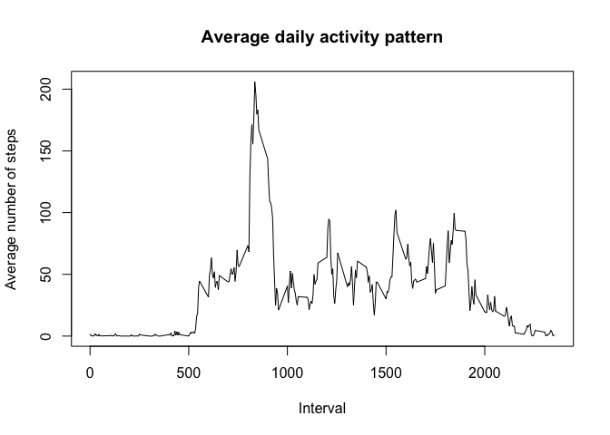

## Loading and preprocessing of the data

```r
## Unzip the file
zipFile <- "activity.zip"
unzip(zipFile, files = NULL, exdir = ".")

## Read data
dataFile <- "activity.csv"
activity <- read.csv(dataFile, header = TRUE)

## Format date
activity$date <- as.POSIXct(activity$date, format = "%Y-%m-%d")

str(activity)
```

```
## 'data.frame':	17568 obs. of  3 variables:
##  $ steps   : int  NA NA NA NA NA NA NA NA NA NA ...
##  $ date    : POSIXct, format: "2012-10-01" "2012-10-01" ...
##  $ interval: int  0 5 10 15 20 25 30 35 40 45 ...
```

```r
head(activity)
```

```
##   steps       date interval
## 1    NA 2012-10-01        0
## 2    NA 2012-10-01        5
## 3    NA 2012-10-01       10
## 4    NA 2012-10-01       15
## 5    NA 2012-10-01       20
## 6    NA 2012-10-01       25
```

## Mean total number of steps taken per day

```r
## Calculate the total number of steps per day
total_steps_per_day <- aggregate(steps ~ date, activity, sum)

## Create a histogram of the total number of steps per day
hist(total_steps_per_day$steps, main = "Total number of steps per day",
     xlab = "Number of steps per day")
```

<!-- -->


```r
## Calculate the mean
mean_steps <- mean(total_steps_per_day$steps)
mean_steps <- as.integer(mean_steps)
```

The mean number of steps taken per day is 10766.


```r
## Calculate the median
median_steps <- median(total_steps_per_day$steps)
median_steps <- as.integer(median_steps)
```

The median number of steps taken per day is 10765. 

## Average daily activity pattern


```r
## Make a time series plot (i.e. type = “l”) of the 5-minute interval (x-axis) 
## and the average number of steps taken, averaged across all days (y-axis)

## Average steps per interval for all days
mean_steps_per_interval <- aggregate(steps ~ interval, activity, mean)

## Time series plot
plot(mean_steps_per_interval$interval, mean_steps_per_interval$steps, 
     type = "l", main = "Average daily activity pattern", xlab = "Interval", 
     ylab = "Average number of steps")
```

<!-- -->


```r
## Which 5-minute interval, on average across all the days in the dataset, 
## contains the maximum number of steps?

index <- which.max(mean_steps_per_interval$steps)
interval_with_max <- mean_steps_per_interval[index, ]$interval
max_steps <- as.integer(mean_steps_per_interval[index, ]$steps)
```

The 5-minute interval containing the most number of steps is 835 
with 206 on the average.

## Imputing missing values

Note that there are a number of days/intervals where there are missing values (coded as 
NA). The presence of missing days may introduce bias into some calculations or summaries of the data.

Total number of missing values in the dataset 

```r
colSums(is.na(activity))
```

```
##    steps     date interval 
##     2304        0        0
```

Using the mean of the original dataset to fill in missing values:


```r
library(Hmisc)
newData <- activity
newData$steps <- impute(activity$steps, fun=mean)
```


```r
## Calculate the total number of steps per day
total_steps_per_day <- aggregate(steps ~ date, newData, sum)

## Create a histogram of the total number of steps per day
hist(total_steps_per_day$steps, main = "Total number of steps per day",
     xlab = "Number of steps per day")
```

<!-- -->


```r
## Calculate the mean
new_mean_steps <- mean(total_steps_per_day$steps)
new_mean_steps <- as.integer(new_mean_steps)
```


```r
## Calculate the median
new_median_steps <- median(total_steps_per_day$steps)
new_median_steps <- as.integer(new_median_steps)
```


```r
## Tabulate results
library(data.table)
stat_table <- data.table(x = c("Original", "Adjusted"), y = c(mean_steps, new_mean_steps), 
                         z = c(median_steps, new_median_steps))
names(stat_table) <- c("Dataset", "Mean", "Median")
stat_table
```

```
##     Dataset  Mean Median
## 1: Original 10766  10765
## 2: Adjusted 10766  10766
```

After imputing missing values, we notice a slight change in the median. The mean remained the same.

## Differences in activity patterns between weekdays and weekends


```r
## Create a new factor variable in the dataset with two levels – “weekday” 
## and “weekend” indicating whether a given date is a weekday or weekend day.

activity$weekdays <- weekdays(activity$date)
weekends <- c("Saturday", "Sunday")
activity$dayType <- ifelse(activity$weekdays %in% weekends, "weekend", "weekday")
head(activity)
```

```
##   steps       date interval weekdays dayType
## 1    NA 2012-10-01        0   Monday weekday
## 2    NA 2012-10-01        5   Monday weekday
## 3    NA 2012-10-01       10   Monday weekday
## 4    NA 2012-10-01       15   Monday weekday
## 5    NA 2012-10-01       20   Monday weekday
## 6    NA 2012-10-01       25   Monday weekday
```


```r
library(ggplot2)

## Make a panel plot containing a time series plot (i.e. type = "l") of the 
## 5-minute interval (x-axis) and the average number of steps taken, 
## averaged across all weekday days or weekend days (y-axis).

## Average steps per interval for all days
mean_steps_per_interval <- aggregate(steps ~ interval + dayType, activity, mean)

## Time series plot
g <- ggplot(mean_steps_per_interval, aes(x = interval, y = steps, color=dayType)) 
g <- g + geom_line() + facet_wrap(~dayType, ncol = 1, nrow = 2)
g <- g + theme_bw() + theme(legend.position = "none")
g <- g + theme(plot.title = element_text(hjust = 0.5))
g <- g + ggtitle("Differences in activity patterns between weekdays and weekends")
g <- g + xlab("Interval") + ylab("Number of steps")
g
```

<!-- -->
